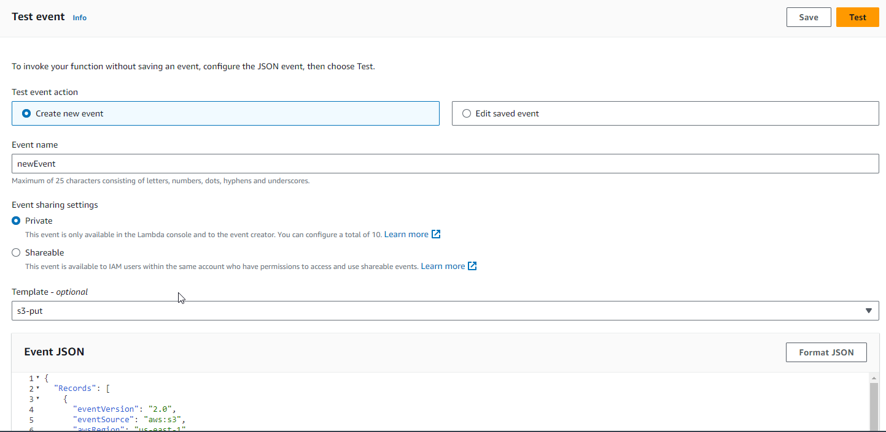
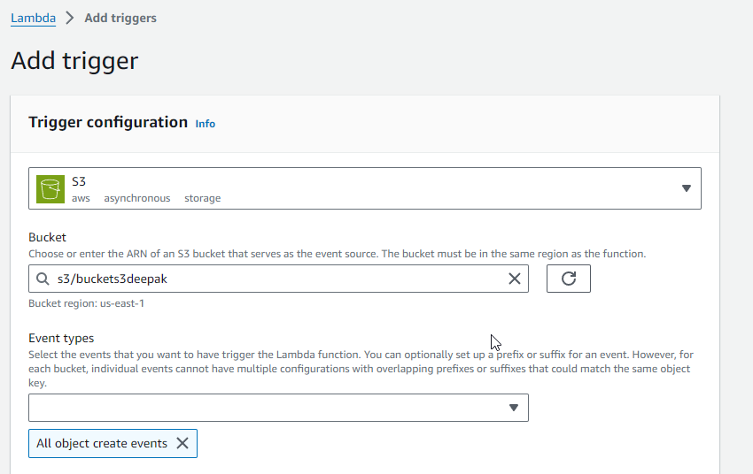
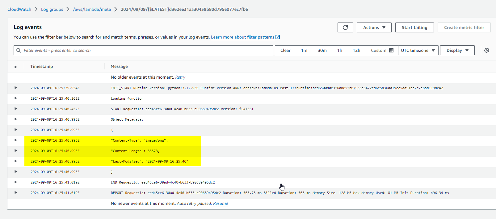

# What is Serverless Computing?
- **Definition**: A cloud-computing model where you run applications without the need to manage the underlying server infrastructure.
- **No Server Management**: Developers don’t need to handle provisioning, scaling, or maintaining servers; this is done by the cloud provider.
- **Pay-as-you-go**: You only pay for the actual resources consumed when your code runs, which reduces costs.

---

## Benefits of Serverless Computing
- **Automatic Scaling**: The system scales up or down automatically based on the demand. For example, if traffic spikes, the system will handle it without any manual intervention.
- **Reduced Complexity**: No need to manage or patch servers, allowing developers to focus on writing and deploying code.
- **Cost Efficient**: You only pay for actual compute time used. There’s no cost for idle infrastructure. For example, you don’t pay for a server that's running all the time but not being used.
- **Faster Development**: Developers can rapidly build and deploy applications, reducing time-to-market.

---

## Real-World Use Cases for Serverless Computing
1. **Netflix**: Uses serverless architecture to manage microservices and scale operations globally, ensuring smooth video streaming during peak times.
2. **Coca-Cola**: Uses AWS Lambda to run vending machines, processing payments and delivering product details to users via a mobile app.
3. **Figma**: Handles collaborative editing and real-time updates in design projects using serverless architecture.
4. **Web & Mobile Backends**: Build scalable APIs for web and mobile apps with serverless.
5. **Data Processing**: Serverless is ideal for real-time data processing, like transforming uploaded files or analyzing logs.

---

# Key Serverless Providers
1. **AWS Lambda**: A popular service from Amazon Web Services for event-driven computing.
2. **Microsoft Azure Functions**: Microsoft's solution for serverless computing, integrating with the Azure ecosystem.
3. **Google Cloud Functions**: A lightweight, event-driven serverless option from Google Cloud.
4. **IBM Cloud Functions**: Based on the Apache OpenWhisk platform, supporting multiple languages.

---

# Introduction to AWS Lambda
- **What is AWS Lambda?**: AWS Lambda is a serverless compute service that automatically runs your code in response to events like HTTP requests, file uploads, or database changes or on a schedule.
- **Key Features**:
  - No need to manage servers.
  - Scales automatically based on the number of incoming requests.
  - Pay only for the compute time used—charged in 100ms increments.
  - Supports multiple programming languages such as Python, Node.js, Java, Go, and more.

---

##  How AWS Lambda Works
1. **Event-Driven Execution**: Lambda is triggered by events such as an image upload to Amazon S3, a new message in an Amazon SQS queue, or an API request from Amazon API Gateway.
2. **Stateless Functions**: Each Lambda function runs independently and is stateless—meaning it doesn't store any data between executions.
3. **Automatic Scaling**: When events trigger Lambda, it automatically scales to handle the number of requests, whether it’s a few per day or thousands per second.

---

##  AWS Lambda Architecture
1. **Event Source**: AWS services (e.g., S3, DynamoDB, API Gateway) or custom event triggers (like IoT devices).
2. **Lambda Function**: The actual code that runs in response to an event. For example, you can use a Python function to process an uploaded image and resize it.
3. **Destination**: The output can be stored in S3, sent to a database like DynamoDB, or logged to CloudWatch for monitoring.

---

# Benefits of AWS Lambda
1. **No Server Management**: AWS manages the infrastructure, letting you focus on coding.
2. **Automatic Scaling**: Lambda automatically adjusts to handle the number of incoming events, whether it's 1 or 1,000,000.
3. **Cost-Effective**: You only pay when your function runs, and you're billed in increments of 100 milliseconds. For example, if a function runs for 500ms, you only pay for that time.
4. **Multi-Language Support**: Lambda supports popular languages like Python, Node.js, Java, and more, making it flexible for different projects.

---

# Real-World AWS Lambda Use Cases
1. **Real-Time File Processing**:
   - **Example**: An image is uploaded to S3. AWS Lambda automatically triggers and resizes the image, compresses it, and stores the optimized version in another S3 bucket.
   - **Benefit**: Fully automated image optimization with no server management.
2. **REST APIs**:
   - **Example**: Use Lambda with API Gateway to create serverless APIs for web or mobile apps.
   - **Benefit**: Automatically scales with traffic, and you only pay for actual API requests.
3. **Scheduled Jobs**:
   - **Example**: Use AWS Lambda to send daily reports or perform nightly database backups, triggered by CloudWatch Events.
   - **Benefit**: No need to run dedicated servers for scheduled tasks.
4. **IoT Data Processing**:
   - **Example**: IoT devices send data to Lambda for real-time processing and storage in DynamoDB.
   - **Benefit**: Scales effortlessly with the number of devices.

---

# Steps to Create an AWS Lambda Function
1. **Step 1**: Open the AWS Lambda Console and create a new function (choose your preferred runtime like Python, Node.js).
2. **Step 2**: Define a trigger, such as an Amazon S3 bucket event or API Gateway request.
3. **Step 3**: Write and upload the function code that handles the trigger (e.g., resizing an image uploaded to S3).
4. **Step 4**: Test the function by creating a test event in the Lambda console to simulate a real-world scenario.
5. **Step 5**: Monitor the function's performance and logs using Amazon CloudWatch.

---


# Practical Tasks:

## Practical Task 1: Activity: AWS Lambda from the Cloud foundation module. 
---
## Practical Task 2: AWS Lambda - Retrieving the metadata of a file that is uploaded in S3 bucket.

In this task, you will utilize AWS Lambda to process files immediately after they're uploaded to services like Amazon S3.Whenever a user uploads an image to the S3 bucket, it should trigger a lambda function that processes the file and logs its metadata to Amazon CloudWatch Logs.

***You are required to follow the following steps to complete the lab***. 

### Step 1: Set Up an S3 Bucket:
1. Go to the S3 Console and create an S3 bucket to upload files. (General Purpose, ACLs disabled, Block Public Access Settings for this bucket, Bucket Versioning: Disabled)


### Step 2:  Create a Lambda Function and select Python 3.11 as run time. In the execution role, use an existing role (LabRole). Use the following source code for the lambda function. Save and deploy the function.

***Code for the function***
```
import json
import boto3
print('Loading function')
s3 = boto3.client('s3')

def lambda_handler(event, context):
    # Retrieve the bucket and object key from the S3 event
    bucket = event['Records'][0]['s3']['bucket']['name']
    object_key = event['Records'][0]['s3']['object']['key']

    try:
        # Get the metadata of the S3 object
        response = s3.head_object(Bucket=bucket, Key=object_key)

        # Extract relevant metadata attributes
        metadata = {
            "Content-Type": response['ContentType'],
            "Content-Length": response['ContentLength'],
            "Last-Modified": response['LastModified'].strftime("%Y-%m-%d %H:%M:%S"),
            # Add more metadata attributes as needed
        }

        # Print the metadata to CloudWatch Logs
        print("Object Metadata:")
        print(json.dumps(metadata, indent=2))

        return {
            'statusCode': 200,
            'body': json.dumps(metadata)
        }
    except Exception as e:
        print(f"Error: {str(e)}")
        return {
            'statusCode': 500,
            'body': 'Error retrieving metadata'
        }

```
### Step 4: Upload a file to the S3 bucket your created earlier


### Step 5: Update the test case and check your function is working as it should. 

1. **Create a test event** in the AWS Lambda Console as in the image below.
2. **Update the bucket name** and image file name in the event to match what exists in your S3 bucket.
3. Click **Test** to run the function.
4. You can now **deploy the function**.



***In the test case, remember to update the bucket name and the file name that is uploaded in s3 bucket.***

### Step 6: Create a trigger so that every time you upload a file to the S3 bucket, it should get the meta info in the logs. 



### Step 7: Go to CloudWatch >> Logs >> Log Groups >> From the list of log, select the log of your function and ensure that you in the log you can see the metadata of the upload files. 



## Challenge: Automating EBS Snapshot Creation 

In this task, you will create a Lambda Function that runs Python code to create EBS snapshots according to the schedule.  

**Note: After completing the tasks, make sure to terminate/delete your resources to avoid unnecessary costs.** 

### Read More
- [AWS Lambda - Developer Guide](https://docs.aws.amazon.com/lambda/latest/dg/welcome.html)
- [Tutorial: Using an Amazon S3 trigger to create thumbnail images](https://docs.aws.amazon.com/lambda/latest/dg/with-s3-example.html)
- [Tutorial: Using an Amazon S3 trigger to invoke a Lambda function](https://docs.aws.amazon.com/lambda/latest/dg/with-s3-tutorial.html)
